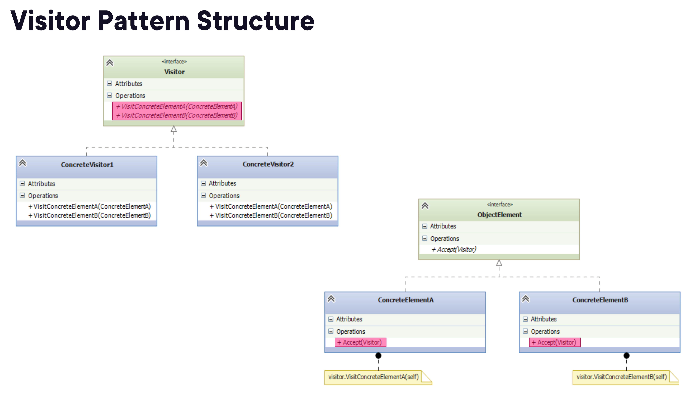

# Visitor Pattern

**Category:** Behavioral

The Visitor pattern lets you add new operations to an object structure without modifying its classes. A visitor object carries the new operation logic and is dispatched to the right method based on the type of each element it visits.

## Structure



## Key Concepts

- **Visitor** (`AbsVisitor`) — declares a `visit()` method for each type of element
- **Concrete Visitor** — implements one operation across all element types
- **Element** (`AbsTree`) — declares an `accept(visitor)` method
- **Concrete Element** — calls `visitor.visit(self)` inside `accept()`
- **Object Structure** — the collection of elements the visitor traverses

## Demos

| Demo | Description |
|------|-------------|
| [BeforeVisitor](demos/BeforeVisitor/) | Pretty-printing and search logic embedded directly in tree node classes |
| [Visitor](demos/Visitor/) | `PrettyPrintVisitor` and `GetOldestVisitor` traverse the tree without modifying it |

### Running the demos

```bash
cd demos/BeforeVisitor
python -m BeforeVisitor

cd demos/Visitor
python -m Visitor
```

## When to Use

- You need to perform many distinct operations on an object structure and want to avoid polluting the element classes
- The object structure is stable but you frequently add new operations
- Operations need to work across several unrelated classes without a common base class
